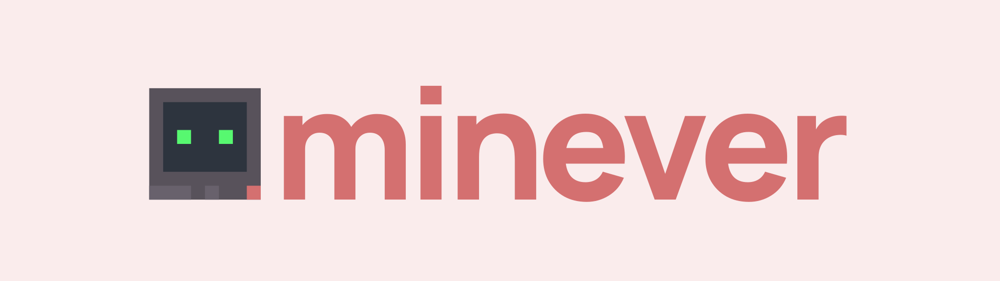

# Minever

Open-source .NET library designed to support various versions of **Minecraft Java & Bedrock** editions that provides tools for building bots and client applications.

## State

In draft. Many things need to be considered.

## License

Minever is licensed under the [MIT](https://github.com/iiKuzmychov/Minever/blob/master/LICENSE.md) license.
